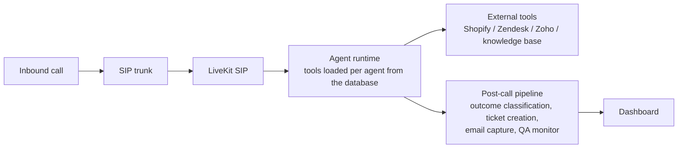

# Julien Joggerst

Founder of [Phosteon](https://www.phosteon.com), a voice AI platform for e-commerce and enterprise customer service. I design, build and operate the whole platform as sole technical owner, using Claude Code as my primary engineering tool.

**What the agents do:** answer customer calls 24/7, identify callers, look up orders, resolve standard requests from a knowledge base, create structured tickets, and hand over to humans with full context.

**What I own:** solution architecture, data model, integrations (Shopify, Zendesk, Zoho CRM/Desk, TheFork, Slack, Stripe, webhooks, SMS), prompt and conversation design, structured testing, deployment, monitoring, incident response.

**Stack, high level:** Python agent runtime on LiveKit Agents, realtime speech-to-speech model, SIP telephony (Twilio, DIDWW), Supabase/Postgres, Google Cloud Run, React dashboard on Cloudflare Pages, Stripe billing. EU-hosted, GDPR-compliant.

**Before Phosteon:** built a D2C brand from a EUR 10k bootstrap to a ~EUR 2M exit across eight European markets; enterprise IT at Ford Motor Company.

Try a live call: [phosteon.com](https://www.phosteon.com)

LinkedIn: [linkedin.com/in/julienjoggerst](https://www.linkedin.com/in/julienjoggerst)
